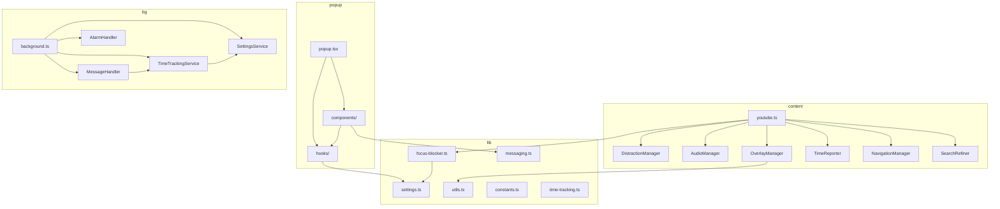

# Dependency Graph

Module dependencies as of the UI overhaul. No circular dependencies.

---

## High-Level Layers

```
Layer 0: plasmo, react, @plasmohq/storage, zod (unused)
Layer 1: lib/ (settings, constants, messaging, time-tracking, focus-blocker, utils)
Layer 2: core/background/*, core/contents/*, hooks/*
Layer 3: components/* (popup, ui, views)
Layer 4: popup.tsx (orchestrator)
```

---

## Entry Point Imports

### `popup.tsx`

```
popup.tsx
├── react (useState)
├── @plasmohq/storage/hook
├── ~/lib/settings, ~/lib/constants, ~/lib/time-tracking
├── ~/hooks/useTheme, ~/hooks/useSettings
├── ~/components/popup/Header, Footer
├── ~/components/ui/TimerCard, DailyLimitCard
└── ~/components/views/MainDashboard, PowerOffView, SupportView, DonateView, BookmarksView
```

### `contents/youtube.ts`

```
contents/youtube.ts
├── plasmo, @plasmohq/storage
├── ~/lib/settings, ~/lib/constants, ~/lib/messaging, ~/lib/time-tracking
├── ~/lib/focus-blocker                    ← NEW
├── ~/core/contents/DistractionManager
├── ~/core/contents/TimeReporter
├── ~/core/contents/OverlayManager
├── ~/core/contents/NavigationManager
├── ~/core/contents/SearchRefiner
└── ~/core/contents/AudioManager           ← NEW
```

### `background.ts`

Unchanged — imports four background services only.

---

## Component Dependency Tree

```
popup.tsx
├── hooks/useSettings → lib/settings, @plasmohq/storage/hook
├── hooks/useTheme → lib/settings, @plasmohq/storage/hook
├── components/popup/Header → hooks/useSettings, components/ui/Icons
├── components/popup/Footer
├── components/ui/TimerCard → lib/time-tracking, lib/utils, hooks/useSettings
├── components/ui/DailyLimitCard → lib/settings, hooks/useSettings
├── components/views/MainDashboard → hooks/useSettings, lib/utils, ui/Icons, ui/CustomToggle
├── components/views/BookmarksView → lib/messaging, @plasmohq/storage/hook
├── components/views/PowerOffView → hooks/useSettings
├── components/views/SupportView
└── components/views/DonateView
```

---

## Content Managers

```
contents/youtube.ts
    │
    ├── DistractionManager → lib/constants, lib/settings
    ├── AudioManager → lib/settings                          [NEW]
    ├── OverlayManager → lib/messaging, lib/constants, lib/settings, lib/utils
    ├── TimeReporter → lib/messaging, lib/constants, lib/time-tracking
    ├── NavigationManager → lib/settings, lib/constants
    ├── SearchRefiner → lib/settings
    └── isFocusScheduleActive → lib/focus-blocker, lib/settings  [NEW]
```

---

## Library Internal Dependencies

```
lib/settings.ts         → (standalone)
lib/time-tracking.ts    → (standalone)
lib/constants.ts        → (standalone)
lib/focus-blocker.ts    → lib/settings (type import)         [NEW]
lib/utils.ts            → (standalone)                        [NEW]
lib/messaging.ts        → lib/time-tracking (type import)
```

---

## External Packages

| Package | Version | Used By |
|---------|---------|---------|
| `plasmo` | 0.90.5 | Content script config |
| `react` / `react-dom` | 18.2.0 | All popup components |
| `@plasmohq/storage` | ^1.15.0 | Background, content, hooks |
| `zod` | ^4.4.3 | **Not imported anywhere yet** |

---

## Browser APIs (New)

| API | Used By | Purpose |
|-----|---------|---------|
| `AudioContext` / `webkitAudioContext` | `AudioManager` | Audio processing graph |
| `MediaElementAudioSourceNode` | `AudioManager` | Hook video element audio |
| `GainNode`, `BiquadFilterNode` | `AudioManager` | Volume + EQ |
| `chrome.tabs.query` | `BookmarksView` | Detect active YouTube tab |
| `chrome.tabs.sendMessage` | `BookmarksView` → content | GET_CURRENT_TIME, SEEK_TO_TIME |

---

## Visual Dependency Graph



---

## Cross-Context Communication (No Direct Imports)

| From | To | Mechanism |
|------|-----|-----------|
| Popup | Content | `chrome.tabs.sendMessage` (bookmarks) |
| Popup | Background | `@plasmohq/storage` (settings) |
| Content | Background | `chrome.runtime.sendMessage` (time tracking) |
| Background | Content | `chrome.tabs.sendMessage` (daily limit) |
| Popup | Content | `storage.watch` → content reacts to settings |

Popup **never imports** content or background modules directly.
